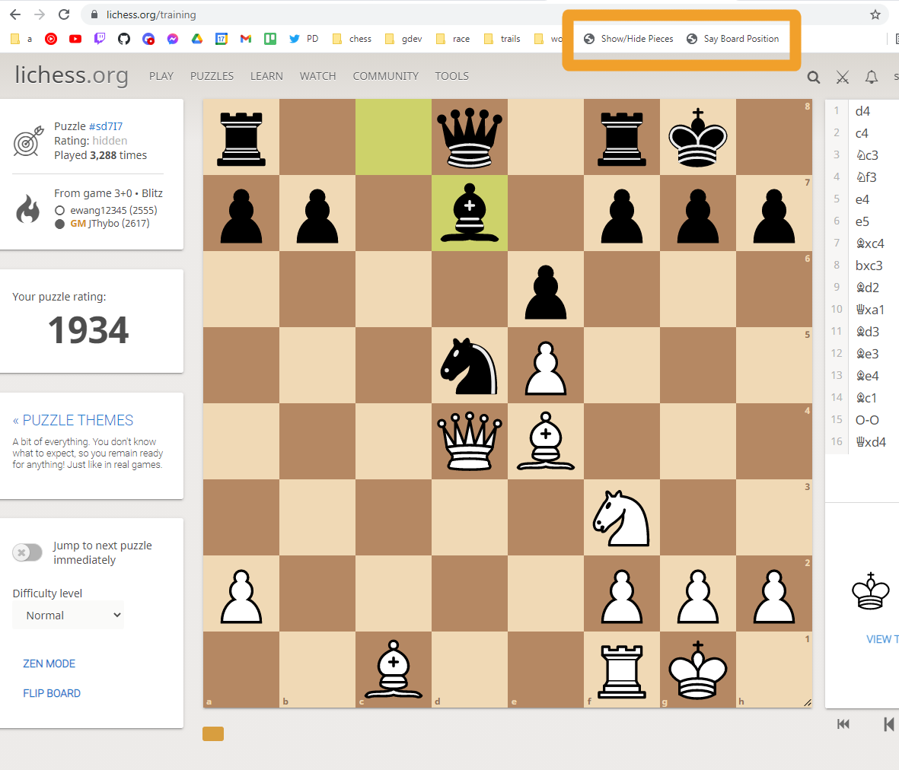

# blindfoldBookmarkletLichess

# What Does this Code Do?

This code is designed to help one practice blindfold chess tactics on Lichess. This repo contains bookmarklets that can `show/hide` the pieces while solving a Lichess puzzle, and `speak the current board position` audibly.

# How to Use This Code

1. Open <a href="https://strawstack.github.io/blindfoldBookmarkletLichess/" target="_blank">this site</a>.

2. Drag the links into your bookmarks bar.

3. When viewing a Lichess puzzle, click the bookmarklet.

4. The desired effect will then occur. (pieces will be shown/hidden or board position will be spoken).

# More Info about Bookmarklets

https://caiorss.github.io/bookmarklet-maker/

# View the Source Code

The JS source code for this tool is available in `boardPosition.js` and `showHide.js`.

# Screenshot

